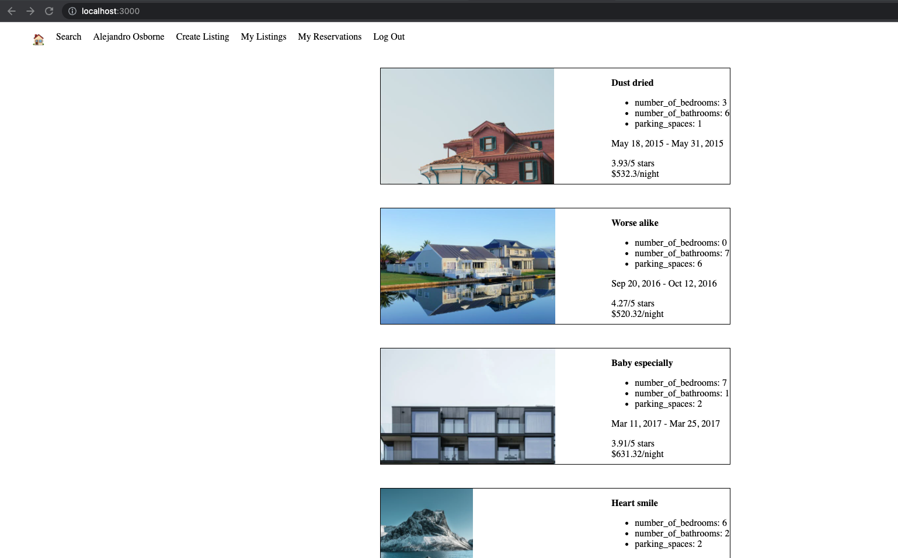

# LightBnB

Lighthouse BnB is an application that allows homeowners to rent out their homes. Users can search their dream vacation properties, book their reservation and provide reviews. 

## Final Product

## Getting Started

1. [Create](https://docs.github.com/en/repositories/creating-and-managing-repositories/creating-a-repository-from-a-template) a new repository using this repository as a template.
2. Clone your repository onto your local device.
3. Go to LightBnB_WebApp directory
4. Install dependencies using the `npm install` command.
5. Start the web server using the `npm run local` command. The app will be served at <http://localhost:3000/>.
6. Go to <http://localhost:3000/> in your browser.

## Dependencies

- Express
- Node 5.10.x or above
- body-parser
- Bcrypt
- Cookie-session
- Nodemon
- Pg

## ERD

ERD is included for reference.
